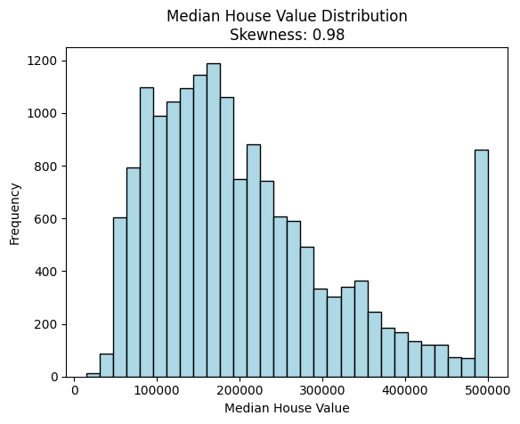
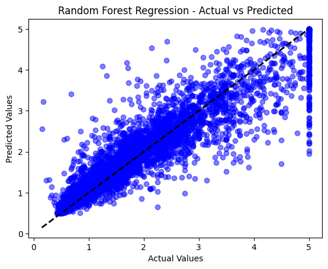
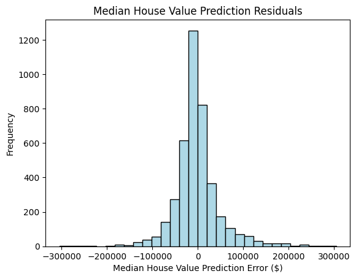
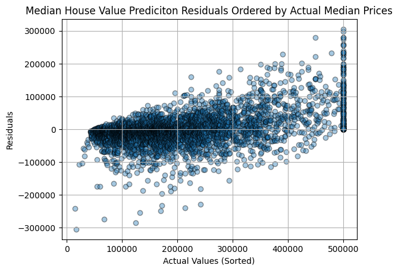
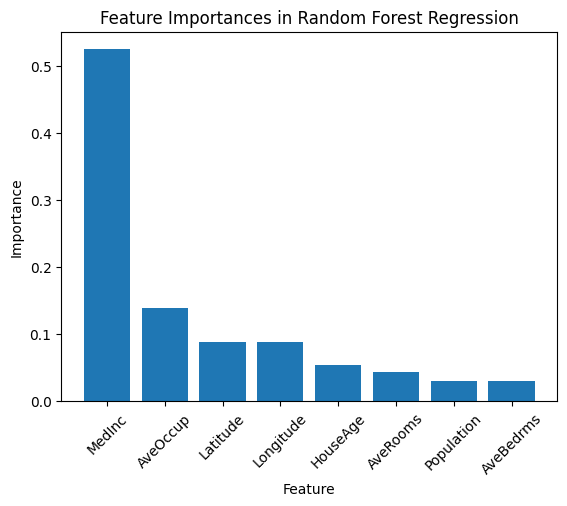

# Evaluating Random Forest Performance on California Housing Data

Here I implement and evaluate the performance of random forest regression models on real-world data.

## Project overview

This project builds a Random Forest Regressor on the California Housing dataset from `scikit-learn` and evaluates how well it predicts median house values from socioeconomic and geographic features.

The notebook covers:
- package installation and imports
- dataset loading and train/test split
- basic exploratory data analysis
- model training with random forest regression
- regression evaluation using MAE, MSE, RMSE, and R²
- residual analysis
- feature importance analysis
- interpretation of model strengths and limitations

## Dataset

The dataset used is the California Housing dataset. The target variable is:

- `MedHouseVal`: median house value

The input features include:
- `MedInc`
- `HouseAge`
- `AveRooms`
- `AveBedrms`
- `Population`
- `AveOccup`
- `Latitude`
- `Longitude`

## Technical workflow

The notebook follows this pipeline:

1. Install required libraries:
   - `numpy`
   - `pandas`
   - `scikit-learn`
   - `matplotlib`
   - `scipy`

2. Import the necessary modules for:
   - data handling
   - visualization
   - train/test splitting
   - random forest regression
   - regression metrics
   - skewness analysis

3. Load the California Housing dataset using `fetch_california_housing()`.

4. Split the data into training and testing sets using `train_test_split()` with:
   - `test_size=0.2`
   - `random_state=42`

5. Create a DataFrame for exploratory inspection of the training data.

6. Plot the distribution of median house values and compute skewness.

7. Train a `RandomForestRegressor` with:
   - `n_estimators=100`
   - `random_state=42`

8. Predict house values on the test set.

9. Evaluate model performance using:
   - Mean Absolute Error
   - Mean Squared Error
   - Root Mean Squared Error
   - R² score

10. Visualize:
    - actual vs predicted values
    - residual histogram
    - residuals ordered by actual house price
    - feature importances

## Model used: Random Forest Regression

Random forest regression is an ensemble learning method based on many decision trees.

A single decision tree recursively splits the feature space into regions and assigns a prediction value to each region. A random forest improves on this by training many trees on randomized versions of the data and then averaging their predictions.

In plain math, if there are `B` trees and the prediction from tree `b` for input `x` is:

`T_b(x)`

then the random forest prediction is:

`f(x) = (1/B) * sum_{b=1 to B} T_b(x)`

This averaging reduces variance and usually gives better generalization than a single deep tree.

### Why random forest is useful here

Random forest regression is useful when:
- relationships between features and target are nonlinear
- interactions between variables matter
- the data may contain skewness or outliers
- you want a strong baseline model without heavy feature engineering

It is especially practical here because housing prices are influenced by many interacting factors such as income, geography, occupancy, and property characteristics.

## Evaluation metrics

### MAE, MSE, RMSE, and R²

For true values `y_i` and predictions `yhat_i` over `n` test examples:

**Mean Absolute Error**
`MAE = (1/n) * sum |y_i - yhat_i|`

This gives the average absolute prediction error.

**Mean Squared Error**
`MSE = (1/n) * sum (y_i - yhat_i)^2`

This penalizes larger errors more strongly because of squaring.

**Root Mean Squared Error**
`RMSE = sqrt(MSE)`

This returns the error to the original unit of the target.

**R² score**
`R^2 = 1 - (sum (y_i - yhat_i)^2 / sum (y_i - ybar)^2)`

where `ybar` is the mean of the true target values.

R² measures how much of the target variance is explained by the model relative to predicting the mean every time.

Although the model achieves an R^2 of 0.80, that does not automatically mean its performance is outstanding. It suggests the model captures about 80% of the variability in median home prices, but this statistic can be overly flattering when the data are complex, nonlinear, skewed, or contain extreme values. Its main value is often in comparing competing models rather than judging quality on its own.

In more concrete terms, the model’s prediction errors are still fairly large. The mean absolute error shows that the predicted median house price differs from the true value by about $33,220 on average. The RMSE is even larger at $50,630, reflecting that some mistakes are substantially bigger. This comes from the mean squared error, which is commonly used in model fitting even though it is less directly interpretable because it is measured in squared units.

## Figures

### 1. Median house value distribution

This figure shows the distribution of the target variable. The histogram is right-skewed, which means higher-value homes are less common but still present in significant enough numbers to stretch the distribution.

This matters because skewed targets can make model evaluation harder to interpret, especially when a few expensive homes generate much larger prediction errors.

### 2. Actual vs predicted values

This scatter plot compares true values against model predictions. The dashed diagonal line represents perfect predictions.

A strong model should place many points near the diagonal. Here, the model follows the general trend well, but the spread increases for larger house values, showing that predictions become less precise in the higher-price range.

### 3. Residual distribution

Residuals are defined as:

`residual_i = y_i - yhat_i`

A good regression model often has residuals centered near zero with no major bias. In this plot, the residuals are concentrated around zero, but the spread suggests that some prediction errors are still quite large.

### 4. Residuals ordered by actual values

Even though the overall mean residual is only about -$1,400, the plot shows that the errors are not evenly distributed across the price range. As median house price increases, the residual pattern shifts upward from negative values to positive ones.

This means the model tends to predict too high for cheaper homes and too low for more expensive homes. So while the average residual looks small in aggregate, it hides a clear systematic trend in the errors.

This is an important diagnostic figure because it reveals bias that a single summary metric can miss.

### 5. Feature importance

### Feature importance
Feature importance is a score showing how much each input variable contributes to a model’s predictions.

The feature importance plot ranks variables based on how useful they were across the forest when making splits.

It is reasonable that median income shows up as the strongest predictor, since household income and home values would naturally be expected to move together.

Location also likely plays a major role. Even if it does not appear as a single feature, it is being represented indirectly through latitude and longitude. Because those two variables carry similar importance, it is plausible that together they capture a large amount of the effect of location.

From that perspective, location may actually be the second most influential factor overall. If latitude and longitude were replaced by a single geographic category at a suitable scale, such as neighborhood, suburb, or city, their combined contribution might end up exceeding that of average occupancy.

## Interpretation

Random forest regression handles unusual values and skewed data much better than linear regression. Unlike linear regression, it does not rely on strong assumptions about the underlying distribution, so it is generally less sensitive when the data are far from normal. It also does not require feature standardization in the way distance-based methods such as KNN or SVM typically do.

As for the clipped values, they contain no real spread, so they do not provide useful information about variation in the target. Keeping them may make it harder for the model to reflect the true structure of the data. Removing them during preprocessing could therefore improve how well the model captures meaningful patterns.

Those capped observations may also distort the model’s predictions and give a false impression of performance when using evaluation metrics. That is exactly why inspecting plots and visual summaries is so important: numerical scores alone can hide these kinds of issues.

## Final takeaways

This notebook shows that random forest regression is a strong choice for housing-price prediction because it:
- captures nonlinear patterns
- handles mixed feature effects well
- performs reasonably strongly without feature scaling
- provides interpretable feature importance scores

At the same time, the residual plots show that performance is not equally strong across the full target range. In particular, expensive homes are harder to predict accurately, and aggregate metrics alone do not fully capture this issue.

Overall, the project is a clean demonstration of how to evaluate a regression model beyond just reporting a single score.

## Repository notes

Make sure these image files are included in the repository root, or update the paths if they are stored in another folder:

- `median-house-value.png`
- `median-residual.png`
- `random-forest-regression.png`
- `residual-ordered.png`
- `feature-importance.png`

## File

- Notebook: `evaluating-random-forest-performance.ipynb`
