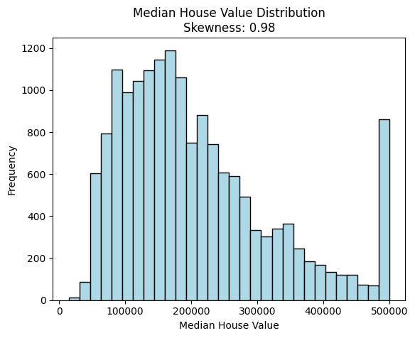
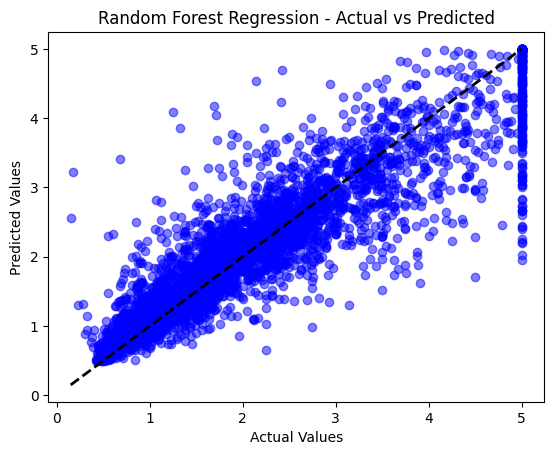
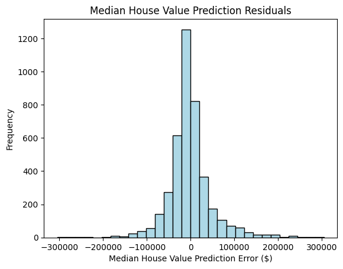
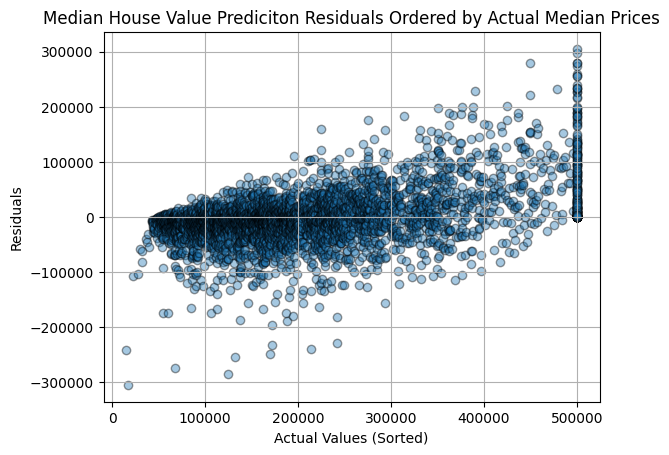
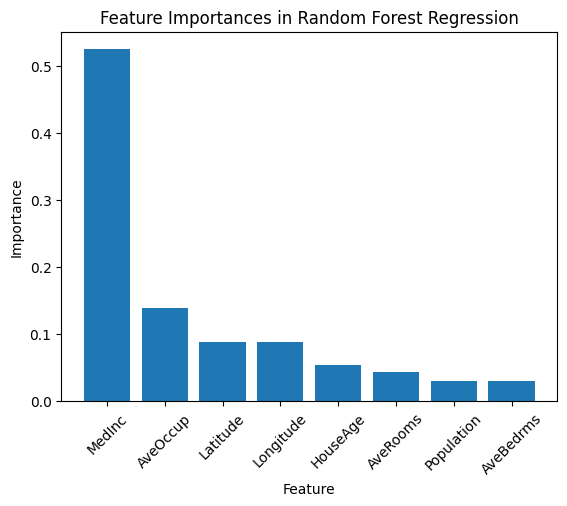

# Evaluating Random Forest Performance on California Housing Data

This project trains a Random Forest Regressor on the California Housing dataset from `scikit-learn` and evaluates how well it predicts median house values from socioeconomic and geographic features.

## Dataset

Target: `MedHouseVal` (median house value)

Features: `MedInc`, `HouseAge`, `AveRooms`, `AveBedrms`, `Population`, `AveOccup`, `Latitude`, `Longitude`

## Workflow

1. Load the data with `fetch_california_housing()`.
2. Split into train/test with `test_size=0.2`, `random_state=42`.
3. Plot the target distribution and compute skewness.
4. Train `RandomForestRegressor(n_estimators=100, random_state=42)`.
5. Predict on the test set.
6. Evaluate with MAE, MSE, RMSE, and R².
7. Plot actual vs. predicted values, residuals, and feature importances.

Libraries: `numpy`, `pandas`, `scikit-learn`, `matplotlib`, `scipy`.

## Random Forest Regression

A random forest trains many decision trees on randomized versions of the data and averages their predictions. With `B` trees:

`f(x) = (1/B) * sum_b T_b(x)`

Averaging reduces variance compared to a single deep tree. It handles non-linear relationships, feature interactions, skewed data, and outliers, and it doesn't need feature scaling.

## Metrics

- `MAE = (1/n) * sum |y_i - yhat_i|`
- `MSE = (1/n) * sum (y_i - yhat_i)^2`
- `RMSE = sqrt(MSE)`
- `R^2 = 1 - sum (y_i - yhat_i)^2 / sum (y_i - ybar)^2`

The model gets R² = 0.80, so it explains about 80% of the variance in median house prices. That alone doesn't mean it is very accurate: the MAE is about $33,220 and the RMSE is about $50,630, so some errors are large. R² is more useful for comparing models than for judging one model on its own.

## Figures

### Target distribution

The target is right-skewed. Expensive homes are less common, and they produce larger errors.

### Actual vs. predicted

The dashed line is perfect prediction. The model follows the trend, but the spread grows for higher house values.

### Residuals

Residuals (`y_i - yhat_i`) are centered near zero, but some errors are large.

The mean residual is only about -$1,400, but the errors are not even across the price range. The model predicts too high for cheaper homes and too low for expensive ones. This bias doesn't show up in the summary metrics.

### Feature importance

Median income is the strongest predictor, which makes sense since income and home values move together. Latitude and longitude have similar importance, so together they capture the effect of location. Combined, location may be the second most important factor. A single location feature like neighborhood or city might rank above average occupancy.

## Notes

- Some target values are clipped (capped at a maximum). They carry no real variation and can distort both the model and the metrics. Removing them during preprocessing could help.
- The residual plots show that expensive homes are harder to predict, which the aggregate metrics hide.

## Files

- `evaluating-random-forest-performance.ipynb`: main notebook
- `median-house-value.png`, `random-forest-regression.png`, `median-residual.png`, `residual-ordered.png`, `feature-importance.png`: figures
